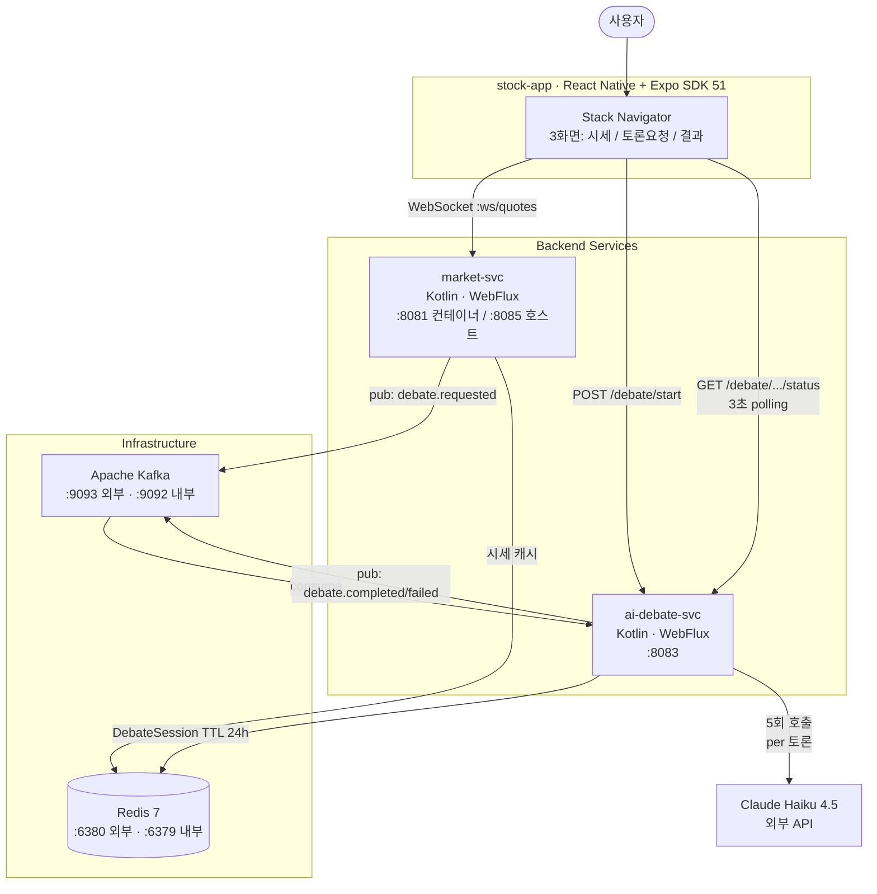
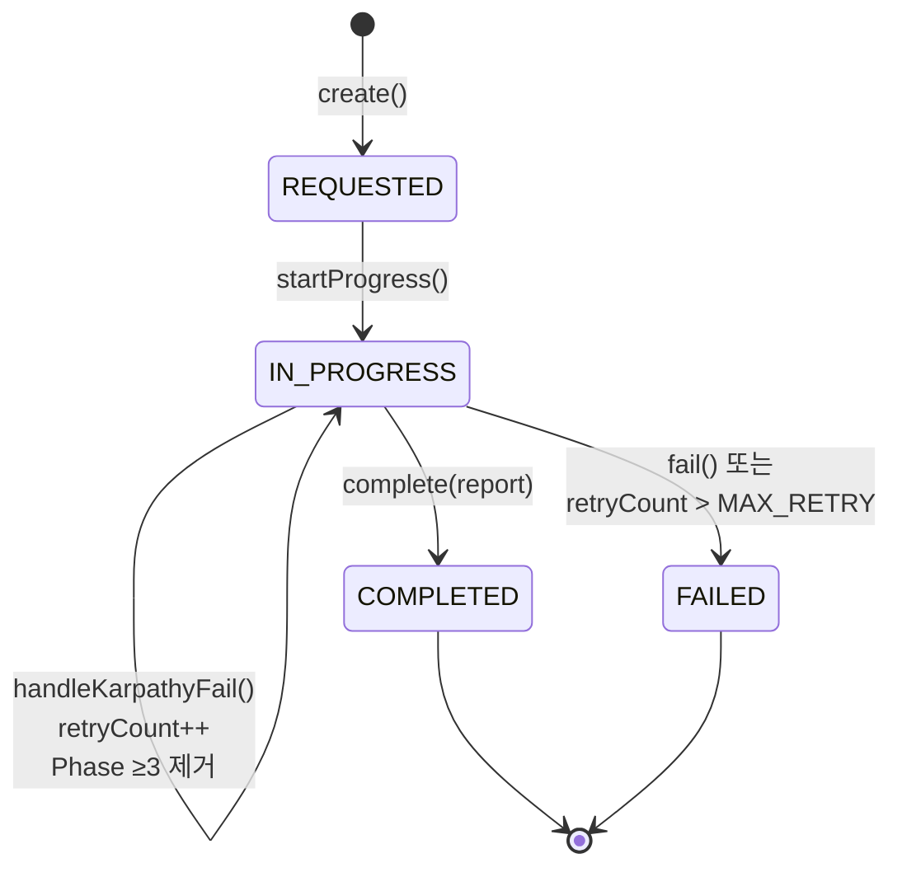
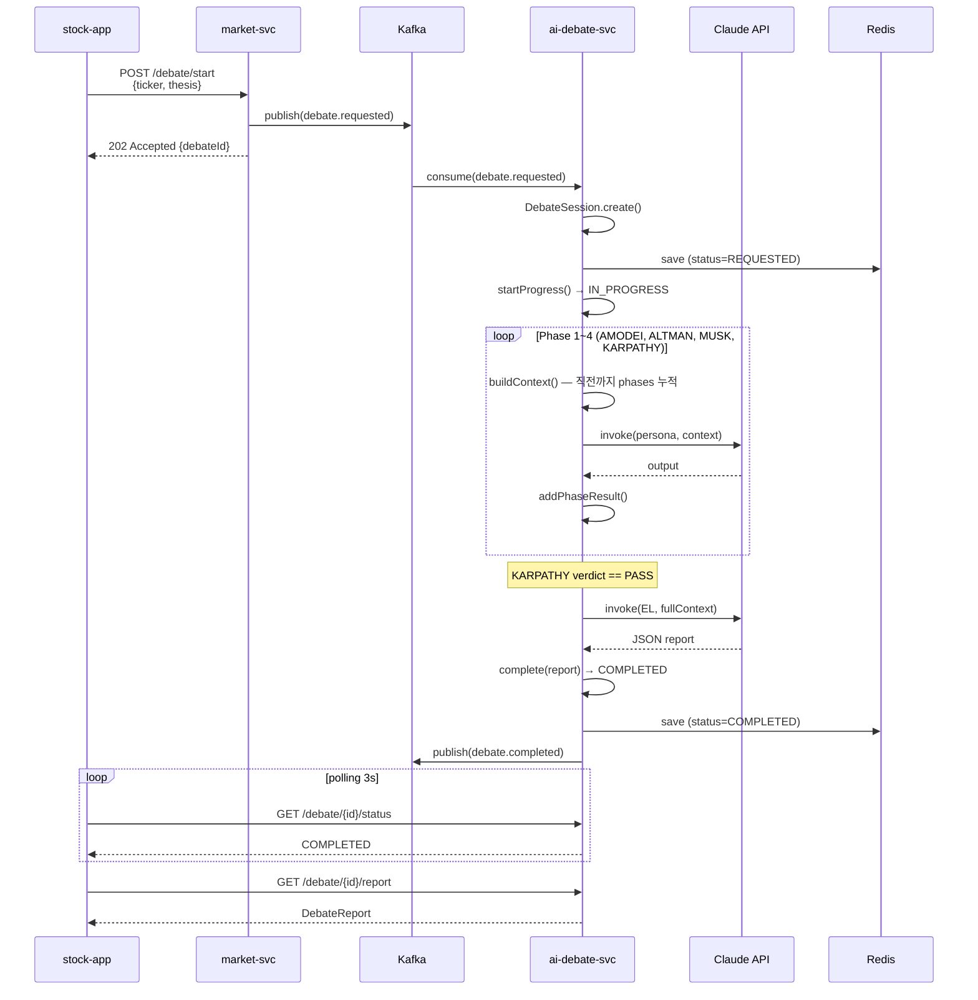

# Architecture — StockProject

> **목적**: 5인 AI 페르소나 토론으로 투자 thesis를 검증하는 시스템의 설계 의사결정과 트레이드오프를 정리.
> **독자**: 기술 면접관, 코드 리뷰어, 신규 합류 개발자.
> **참조**: `README.md` (실행/스택), `STATUS.md` (코드 정독 SSOT, 실측치).

---

## 1. Context & Constraints

### 1.1 도메인 문제

주식 매수 의사결정에서 **confirmation bias**(자신의 가설에 부합하는 정보만 수용)는 가장 흔한 실패 원인입니다. 단일 AI 챗봇에 "이 종목 사야 하나?"를 물으면 — 같은 모델·같은 컨텍스트라면 — 같은 방향의 합리화를 받기 쉽습니다.

### 1.2 검증 가설

> "5명의 AI 페르소나가 *서로 다른 역할*로 *순차적으로* 반박하면, 단일 AI보다 confirmation bias가 구조적으로 줄어든다."

이 가설을 검증할 수 있는 가장 작은 시스템이 본 프로젝트의 범위입니다.

### 1.3 비기능 제약

| 항목 | 목표 | 근거 |
|---|---|---|
| 1회 토론 응답 시간 | < 60초 | Haiku 모델 5회 호출 × ~8초/회 + 오케스트레이션 오버헤드 |
| 1회 토론 비용 | < $0.01 | Haiku 1M token 입력 $0.25, 출력 $1.25 (Sonnet 대비 1/10) |
| 동시 토론 수 | 3 (개념증명 수준) | `KafkaConfig.setConcurrency(3)` |
| 가용성 | 시연 가능 수준 | 단일 노드, replication-factor=1 |

상용 서비스가 아니라 **포트폴리오 + 가설 검증** 목적이라 SLA·고가용성은 의도적으로 미설계.

---

## 2. High-Level Architecture

### 2.1 Container Diagram (C4 Level 2)



ASCII 동등 표현:

```
┌─────────────────────────────────────────────────────────────┐
│  stock-app  (React Native + Expo SDK 51)                    │
│   ├─ 시세 화면 ── WebSocket :ws/quotes/{symbol} ──┐         │
│   ├─ 토론 요청 ── POST /debate/start ─────────────┼─┐       │
│   └─ 결과 화면 ── GET /debate/{id}/status (3s) ───┘ │       │
└────────────────────┬─────────────────────────────────┼───────┘
                     │                                 │
            ┌────────▼──────────┐         ┌────────────▼──────────┐
            │  market-svc       │ Kafka   │   ai-debate-svc       │
            │  :8081 / :8085    │ pub ──▶ │   :8083               │
            │  WebFlux          │         │   WebFlux             │
            │  Redis cache      │         │   PhaseOrchestrator   │
            │  Kafka producer   │         │   (5 페르소나 순차)    │
            └────────┬──────────┘         └────────────┬──────────┘
                     │                                 │
                     │  pub: debate.requested          │  consume + pub:
                     ▼                                 │  debate.completed / failed
        ┌──────────────────────────────────────────────▼──────┐
        │  Apache Kafka  (:9093 호스트, :9092 컨테이너 내부)   │
        │  토픽 4종 (kafka-init이 명시 생성)                   │
        └─────────────────────────────────────────────────────┘
                     │
                     ▼
        ┌─────────────────────────────────────────┐
        │  Redis 7  (:6380 호스트, :6379 컨테이너) │
        │  market-svc 시세 캐시                    │
        │  ai-debate-svc 토론 세션 (TTL 24h)       │
        └─────────────────────────────────────────┘
                     │
                     └─▶ Claude Haiku 4.5 API  (외부, 5회/토론)
```

### 2.2 책임 분리

| 서비스 | 책임 | 책임 *아닌* 것 |
|---|---|---|
| **stock-app** | UI 상태·polling·WebSocket 재연결 | LLM 호출, 비즈니스 결정 |
| **market-svc** | 시세 스트리밍, 토론 요청 게이트웨이(Kafka publish) | LLM 호출, 토론 결과 저장 |
| **ai-debate-svc** | 5인 페르소나 오케스트레이션, LLM 호출, 결과 영속화 | 시세 수집, 사용자 UI |

핵심 의도: **market-svc는 LLM에 무지**. 미래에 토론 트리거 채널이 늘어도(예: 외부 API, 배치 job) market-svc 변경 없이 Kafka로 publish만 추가하면 됩니다.

---

## 3. Domain Model (DDD)

### 3.1 DebateSession Aggregate

```kotlin
class DebateSession private constructor(
    val debateId: DebateId,
    val userId: String,
    val ticker: Ticker,
    val thesis: InvestThesis,
    var status: DebateStatus,
    val phases: MutableList<PhaseResult>,
    var report: DebateReport?,
    val createdAt: Instant,
    var retryCount: Int
)
```

**설계 의도**:
- `private constructor` + `companion object create/reconstruct` — 도메인 객체 생성 경로 단일화. 영속성(Snapshot DTO)에서 복원 시 `reconstruct()` 경유.
- 가변 필드 `status`, `report`, `retryCount`만 var. 다른 필드는 immutable.
- 비즈니스 메서드(`startProgress`, `handleKarpathyFail`, `complete`, `fail`, `addPhaseResult`)가 `require()`로 **상태 전이 불변식**을 강제.

### 3.2 상태 기계



ASCII 동등 표현:

```
[*] ─create()─▶ REQUESTED
                │
                │ startProgress()
                ▼
            IN_PROGRESS ◀──┐
              │   │ KARPATHY FAIL & retryCount ≤ MAX_RETRY
              │   │ (Phase ≥3 제거, retryCount++)
              │   └──────────┘
              │
              ├─ complete(report) ──▶ COMPLETED ──▶ [*]
              │
              └─ fail() / retryCount > MAX_RETRY ──▶ FAILED ──▶ [*]
```

### 3.3 Value Objects

| 타입 | 표현 | 불변식 |
|---|---|---|
| `DebateId` | `UUID` 별칭 | — |
| `Ticker` | `data class Ticker(val value: String)` | (확장 여지) 종목 코드 형식 검증 |
| `InvestThesis` | `data class InvestThesis(val content: String)` | (확장 여지) 길이 제한 |
| `PersonaType` | `enum` (AMODEI/ALTMAN/MUSK/KARPATHY/EL) | `phaseNum` 1~5, `displayName` |
| `Verdict` | `enum` (PASS/HOLD/FAIL) | KARPATHY 출력 파싱 결과 |
| `DebateStatus` | `enum` (REQUESTED/IN_PROGRESS/COMPLETED/FAILED) | 상태 기계 4상태 |

### 3.4 Hexagonal Ports

도메인 → 인프라 의존성 역전. 도메인은 인터페이스만 정의, 어댑터는 인프라 패키지가 구현.

| Port (domain) | Adapter (infrastructure) | `@Profile` |
|---|---|---|
| `LlmPort` | `ClaudeApiAdapter` | `prod` |
| `LlmPort` | `MockLlmAdapter` | `mock`, `test` |
| `EventPublisherPort` | `KafkaEventPublisher` | (전 환경) |
| `DebateSessionRepository` | `RedisDebateSessionRepository` | `prod` |
| `DebateSessionRepository` | `InMemoryDebateSessionRepository` | `mock`, `test` |
| `StartDebateUseCase` / `GetDebateReportUseCase` / `RetryDebateUseCase` | `DebateOrchestrationService` | (전 환경) |

---

## 4. 5-Persona Orchestration

### 4.1 시퀀스 — 정상 흐름 (KARPATHY PASS)



ASCII 압축 흐름:

```
RN ─POST /debate/start─▶ MS ─pub debate.requested─▶ Kafka ─consume─▶ DS
                          │                                              │
                          └──── 202 {debateId} ────▶ RN                  │
                                                                          │
DS: create() ─▶ save(REQUESTED) ─▶ startProgress() ─▶ IN_PROGRESS        │
   │                                                                      │
   ├─ Phase 1: AMODEI  ─ buildContext() ─▶ LlmPort ─▶ addPhaseResult     │
   ├─ Phase 2: ALTMAN  ─ buildContext() ─▶ LlmPort ─▶ addPhaseResult     │
   ├─ Phase 3: MUSK    ─ buildContext() ─▶ LlmPort ─▶ addPhaseResult     │
   ├─ Phase 4: KARPATHY ─ buildContext() ─▶ LlmPort ─▶ verdict 추출      │
   │                                                                      │
   │  if FAIL: handleKarpathyFail() → Phase ≥3 제거, retryCount++        │
   │            └─ canRetry? → MUSK 부터 재시도 (재귀)                    │
   │            └─ else → fail() → publish(debate.failed)                 │
   │                                                                      │
   └─ Phase 5: EL      ─ buildContext(전체) ─▶ LlmPort ─▶ JSON parse     │
                       ─▶ complete(report) ─▶ COMPLETED                   │
                       ─▶ publish(debate.completed)                       │
                                                                          ▼
                                            RN polling: status COMPLETED → report 조회
```

### 4.2 Partial Visibility 알고리즘

```kotlin
fun buildContext(): String = phases.joinToString("\n\n") { phase ->
    "[${phase.persona.displayName}]\n${phase.output}" +
        if (phase.counterArgs.isNotEmpty())
            "\n반론: ${phase.counterArgs.joinToString(" / ")}"
        else ""
}
```

**왜 "전체 누적"인가** — 3가지 선택지 비교:

| 옵션 | 컨텍스트 범위 | 함정 |
|---|---|---|
| α. 전체 공개 | 모든 페르소나가 같은 컨텍스트 + 모든 phase 결과 | **groupthink** — 합의가 너무 쉽게 형성됨 |
| β. 직전만 | 페르소나 N은 N-1의 발언만 봄 | **누적 손실** — Phase 1의 리스크 분석이 Phase 4에서 휘발 |
| γ. **전체 누적** | 페르소나 N은 1~N-1 모든 phase를 순서대로 봄 | (채택) — α와 β의 중간점 |

옵션 γ가 채택된 이유: 페르소나 *역할*(시스템 프롬프트)이 서로 다르고 반론을 유도하는 출력 형식이 강제되어 있으므로, 컨텍스트를 누적해도 groupthink 위험이 약함. 반대로 누적 손실은 회복 불가능한 정보 손실이라 더 큰 비용.

### 4.3 KARPATHY 거부권 + 재시도 메커니즘

```kotlin
fun handleKarpathyFail(): Boolean {
    retryCount++
    return if (retryCount <= MAX_RETRY) {
        phases.removeAll { it.phaseNum >= 3 }  // MUSK·KARPATHY 결과 폐기
        true
    } else {
        status = DebateStatus.FAILED
        false
    }
}
```

| 항목 | 값 | 근거 |
|---|---|---|
| `MAX_RETRY` | 2 (도메인 상수) | 무한 토론 방지 + 합리적 재시도 횟수 |
| 최대 시도 횟수 | 3 (초기 1 + 재시도 2) | `retryCount` 0→1→2 동안 재실행 |
| 재시도 시작 Phase | 3 (MUSK) | AMODEI·ALTMAN의 *초기 분석*은 보존, *반론/판정*만 다시 |
| 초과 시 동작 | `DebateStatus.FAILED` + `DebateFailedEvent(reason="KARPATHY_MAX_RETRY")` | 도메인 이벤트로 외부 관측 가능 |

---

## 5. Event-Driven Boundary

### 5.1 토픽 매트릭스

| 토픽 | Producer | Consumer | 페이로드 | 의도 |
|---|---|---|---|---|
| `debate.requested` | market-svc | ai-debate-svc | `{userId, ticker, thesis, price}` | 토론 시작 요청 |
| `debate.phase.completed` | ai-debate-svc | (관측·로깅용) | `PhaseCompletedEvent` | Phase별 진행 추적 |
| `debate.completed` | ai-debate-svc | (앱 polling 보조) | `{debateId, symbol, successProbability, status}` | 토론 성공 종료 |
| `debate.failed` | ai-debate-svc | (관측·재시도 트리거) | `{debateId, symbol, reason}` | 토론 실패 종료 |

### 5.2 신뢰성 설정 (`KafkaConfig.kt` + `application.yml`)

```kotlin
// Producer
ProducerConfig.ACKS_CONFIG to "all"        // ISR 전부 ack 받아야 성공
ProducerConfig.RETRIES_CONFIG to 3         // transient 실패 자동 재시도

// Consumer
ConsumerConfig.ENABLE_AUTO_COMMIT_CONFIG to false   // 수동 커밋만
ConsumerConfig.MAX_POLL_RECORDS_CONFIG to 1        // debateId 순서 보장
ContainerProperties.AckMode.MANUAL_IMMEDIATE       // 오케스트레이션 완료 후 커밋
```

**왜 `enable-auto-commit=false`인가**: auto-commit은 poll 직후 자동 커밋 → 토론 도중 컨테이너가 죽으면 메시지 유실. 수동 커밋으로 *오케스트레이션 완료 시점*까지 커밋을 지연시켜 at-least-once 보장.

**왜 `MAX_POLL_RECORDS=1`인가**: 동일 파티션 내에서 한 번에 1건만 처리 → KARPATHY 재시도 중인 토론이 다른 토론과 인터리브되지 않음. 단일 노드 시연 환경에서는 충분.

### 5.3 kafka-init — 토픽 명시 생성

`docker-compose.yml`은 `KAFKA_AUTO_CREATE_TOPICS_ENABLE=true`임에도 별도 `kafka-init` 컨테이너에서 4개 토픽을 명시 생성합니다.

**이유**: auto-create는 첫 produce 시점에 토픽이 생성되는데, 그 사이 producer가 retry로 시간을 낭비. 명시 생성으로 first-message-loss 가능성과 startup 지연을 모두 제거.

```yaml
kafka-init:
  entrypoint: |
    kafka-topics --create --if-not-exists --topic debate.requested ...
    kafka-topics --create --if-not-exists --topic debate.completed ...
    kafka-topics --create --if-not-exists --topic debate.failed ...
    kafka-topics --create --if-not-exists --topic debate.phase.completed ...
```

---

## 6. Persistence & Profile

### 6.1 Redis (`@Profile("prod")`)

```kotlin
@Repository
@Profile("prod")
class RedisDebateSessionRepository(...) {
    private val keyPrefix = "debate:session:"
    private val ttl = Duration.ofHours(24)

    override fun save(session: DebateSession): Mono<DebateSession> =
        Mono.fromCallable { objectMapper.writeValueAsString(session.toSnapshot()) }
            .flatMap { json ->
                redisTemplate.opsForValue().set(key(session.debateId), json, ttl)
                    .thenReturn(session)
            }
}
```

**Snapshot DTO 패턴** — `DebateSession`은 `private constructor`라 Jackson이 직접 역직렬화 불가. `DebateSessionSnapshot` data class에 한 번 직렬화한 뒤, 복원 시 `DebateSession.reconstruct()` 팩토리로 우회. 도메인 객체의 생성 경로 단일성을 영속성과 양립.

**왜 TTL 24h인가**: 토론 데이터는 *일회성*. 사용자가 결과를 본 후 재방문하지 않는 시나리오가 대부분이고, 24시간 이내에 polling·재시도·관측이 모두 일어남. 24h가 지나면 안전하게 삭제.

### 6.2 InMemory (`@Profile("mock")`, `@Profile("test")`)

같은 `DebateSessionRepository` 인터페이스를 `ConcurrentHashMap`으로 구현. Redis 의존성 없이 standalone 기동 가능 — 로컬 개발·테스트 편의 + Redis 장애 시 폴백 옵션.

### 6.3 docker-compose 오버라이드 매트릭스

| 서비스 | `application.yml` 기본값 | `docker-compose.yml` 오버라이드 | 활성 어댑터 |
|---|---|---|---|
| ai-debate-svc | `mock` | `SPRING_PROFILES_ACTIVE: prod` | ClaudeApiAdapter + RedisRepo |
| market-svc | `mock` | `SPRING_PROFILES_ACTIVE: mock` | MockStockQuoteAdapter |

**시연 환경 의도**:
- ai-debate는 *실제 LLM*을 보여줘야 가치가 있으므로 prod 강제. `ANTHROPIC_API_KEY` 필수.
- market-svc는 외부 API(Alpha Vantage) 없이 시연 가능해야 하므로 mock 유지.

---

## 7. Cross-Cutting Concerns

### 7.1 WebSocket JWT 핸드셰이크 (STEP 4 — `ad575b4`)

```kotlin
@Component
class WebSocketHandshakeInterceptor(...) : WebFilter {
    override fun filter(exchange, chain): Mono<Void> {
        if (!path.startsWith("/ws/")) return chain.filter(exchange)

        val token = exchange.request.queryParams.getFirst("token")
        if (token.isNullOrBlank()) return unauthorized(exchange)

        if (isMockProfile() && token == devToken) return chain.filter(exchange)

        return try {
            val claims = parser.parseSignedClaims(token).payload  // HS256 검증
            chain.filter(exchange)
        } catch (e: Exception) {
            unauthorized(exchange)
        }
    }
}
```

**구현 노트**:
- **`HandshakeInterceptor` 대신 `WebFilter`** — Spring WebFlux는 전통적인 `HandshakeInterceptor`를 지원하지 않음. WebFilter로 HTTP Upgrade 이전에 검증.
- **mock 프로파일 dev-token bypass** — 시연·테스트 편의. prod에서는 dev-token이 jwtSecret 서명과 불일치하므로 자동 차단.
- **토큰 위치 = 쿼리파라미터** — WebSocket 표준상 핸드셰이크 헤더 제어가 어려운 클라이언트(특히 RN/브라우저)를 고려. 보안상 HTTPS 전송 필수.

### 7.2 헬스체크 + depends_on

```yaml
ai-debate-svc:
  depends_on:
    kafka: { condition: service_healthy }
    market-redis: { condition: service_healthy }
  healthcheck:
    test: ["CMD", "curl", "-f", "http://localhost:8083/actuator/health"]
```

Spring Boot Actuator `/actuator/health` + docker-compose `condition: service_healthy`로 부팅 순서 보장. ai-debate-svc는 Kafka·Redis가 healthy일 때만 기동.

### 7.3 에러 모드 분석

| 시나리오 | 동작 | 도메인 결과 |
|---|---|---|
| Claude API timeout / 5xx | `onErrorResume` → `session.fail()` | `DebateStatus.FAILED`, polling 시 즉시 통지 |
| Redis 연결 끊김 (`save` 실패) | `onErrorResume` → `session.fail()` | 동일 |
| Kafka publish 실패 | `acks=all` + `retries=3`로 자체 복구. 그래도 실패 시 로그만 (이벤트 발행 실패는 토론 완료를 무효화하지 않음) | 토론 완료, 외부 관측만 누락 |
| KARPATHY 무한 FAIL | `MAX_RETRY=2` 도메인 불변식 | 3회 시도 후 `DebateFailedEvent(reason="KARPATHY_MAX_RETRY")` |
| EL JSON 파싱 실패 | 2단계 fallback (중괄호 추출 → 기본 리포트 생성) | `successProbability=50` + 디폴트 액션 3개 |

---

## 8. Trade-offs & Decisions (ADR 요약)

### ADR-1: Spring WebFlux over Spring MVC

- **결정**: 두 서비스 모두 WebFlux + Reactor.
- **이유**: Claude API 호출당 평균 8초의 IO-bound 지연. MVC의 thread-per-request 모델에서는 1 토론당 5 스레드 점유 × 동시 토론 수만큼 스레드 고갈 위험. WebFlux는 event-loop로 수십 토론 동시 처리 가능.
- **트레이드오프**: 학습 곡선 (`Mono`/`Flux` 추상화), 디버깅 시 스택트레이스 가독성 ↓, 블로킹 코드 혼입 위험.

### ADR-2: Kafka over RabbitMQ / 동기 호출

- **결정**: market-svc → ai-debate-svc 통신을 Kafka로.
- **이유**: (1) 미래 확장 — debate.completed를 외부 분석 시스템·알람·재평가 파이프라인이 소비할 수 있게 일관된 이벤트 스트림 제공. (2) 시연 가능성 — Kafka는 면접에서 더 자주 등장하는 기술. (3) 토론 처리 지연(수십 초)을 RN polling으로 분리하기에 적합한 비동기 모델.
- **트레이드오프**: 인프라 무게 ↑ (zookeeper + kafka + kafka-init). 단일 노드 시연 환경에서 6초 부팅 추가.

### ADR-3: Claude Haiku over Sonnet

- **결정**: `claude-haiku-4-5-20251001`.
- **이유**: 5인 토론 = 5회 API 호출. Sonnet 기준 1회 토론 약 $0.05, 응답 ~40초. Haiku로 $0.005, ~10초로 단축.
- **트레이드오프**: 추론 깊이 ↓. 다만 본 프로젝트의 가설(*5인 합의가 단일 AI보다 나은가*) 검증에는 페르소나 *분리*가 모델 *깊이*보다 중요하다고 판단.

### ADR-4: DDD + Hexagonal Architecture

- **결정**: `domain` / `application` / `infrastructure` 3-layer + Port-Adapter.
- **이유**: LlmPort·EventPublisherPort·DebateSessionRepository를 어댑터로 분리 → 테스트 시 MockLlmAdapter 주입, mock 프로파일에서 InMemoryRepo 사용. 인프라 교체(Redis → DynamoDB 등) 시 도메인 변경 0건.
- **트레이드오프**: 보일러플레이트 ↑ (Port 인터페이스 + Adapter 클래스). 단일 인프라만 쓸 거라면 과한 추상화.

### ADR-5: Partial Visibility = "전체 누적"

- **결정**: 매 페르소나가 이전까지 *모든* phase의 출력을 컨텍스트로 받음.
- **이유**: §4.2 참고. 직전만 보면 정보 휘발, 전부 같이 보면 groupthink. 누적이 두 함정의 중간점.
- **트레이드오프**: phase가 늘수록 컨텍스트 토큰 증가 → 비용·지연 증가. Phase 5 EL은 전체 컨텍스트로 가장 무거움.

### ADR-6: 토론 결과 영속성 TTL = 24h

- **결정**: `Duration.ofHours(24)`.
- **이유**: 토론 데이터의 가치 곡선이 짧음(결과 본 후 재방문 드묾). 24h가 polling·재시도·관측 모두 충분히 커버.
- **트레이드오프**: 24h 이후 결과 조회 불가. 장기 보관 필요 시 별도 데이터 웨어하우스로 이관 필요(Week 2~4 범위 외).

---

## 9. 운영 / 시연 환경 차이

| 항목 | 로컬 standalone | docker-compose | 미래 prod |
|---|---|---|---|
| ai-debate 프로파일 | mock | prod (override) | prod |
| market 프로파일 | mock | mock (override) | prod (Alpha Vantage 연결) |
| LlmPort | MockLlmAdapter | ClaudeApiAdapter | ClaudeApiAdapter |
| DebateSessionRepository | InMemory | Redis (TTL 24h) | Redis or 외부 cache |
| 시세 어댑터 | MockStockQuoteAdapter | MockStockQuoteAdapter | Alpha Vantage |
| `ANTHROPIC_API_KEY` 필요 여부 | 아니오 | **예** | 예 |
| WebSocket 인증 | dev-token bypass | dev-token bypass (mock 프로파일) | JWT 필수 |

---

## 10. 측정·검증 (잔여 작업)

본 문서 작성 시점(2026-05-13)에서 *설계상 보장*은 정리됐지만 *실측치*는 미수집 영역이 있음.

| 항목 | 현재 상태 | 다음 STEP |
|---|---|---|
| 1회 토론 p50/p95/p99 지연 | 미측정 | Week 3 k6 시나리오 (STEP 4) |
| 동시 토론 처리량 한계 | 미측정 | 동상 |
| 단일 AI vs 5인 토론 결과 일치율 | 미측정 | 면접後 별도 실험 |
| Kafka rebalance 시 메시지 유실 여부 | `enable-auto-commit=false`로 설계상 방어, 실증 없음 | Week 3 부하 테스트 중 |
| Redis 장애 시 그레이스풀 디그레이드 | 코드상 `onErrorResume`으로 FAILED 처리, 실증 없음 | Week 1 STEP 5 (장애복구 시나리오) |

---

## 변경 이력

- v0.1 · 2026-05-13 · Week 1 STEP 7 초안 작성. 워크트리 `lucid-burnell-48f33a` (HEAD `25964ec` 시점). SSOT — `DebateSession.kt`, `PhaseOrchestrator.kt`, `DebateOrchestrationService.kt`, `application.yml`, `KafkaConfig.kt`, `RedisDebateSessionRepository.kt`, `WebSocketHandshakeInterceptor.kt`, `docker-compose.yml` 직접 read.
