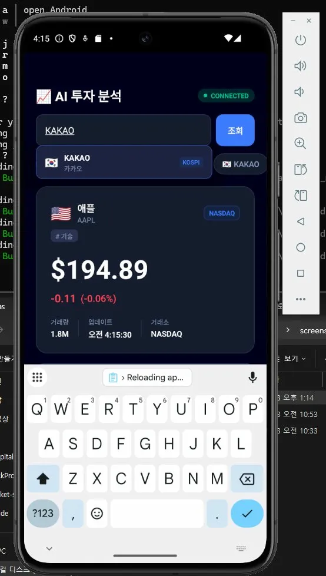
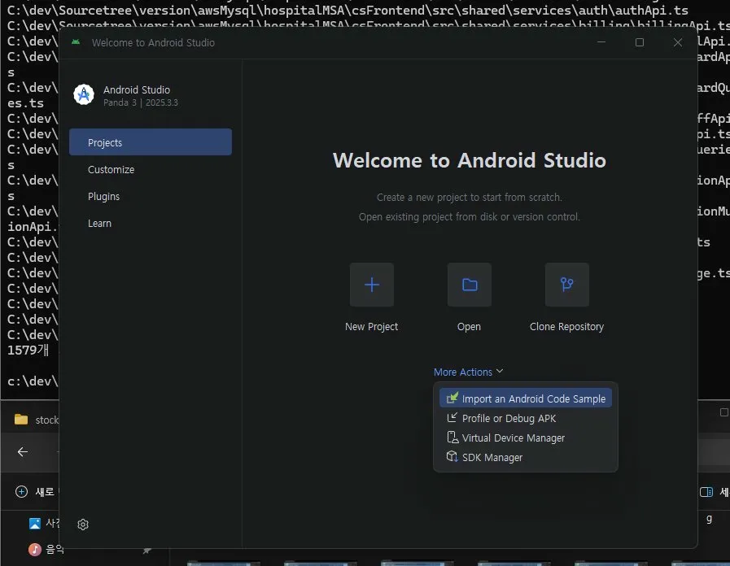
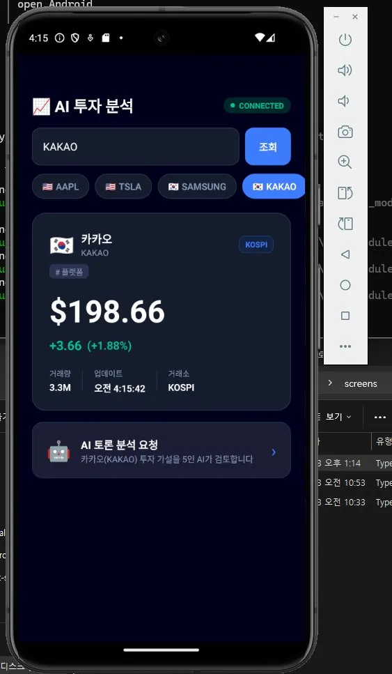
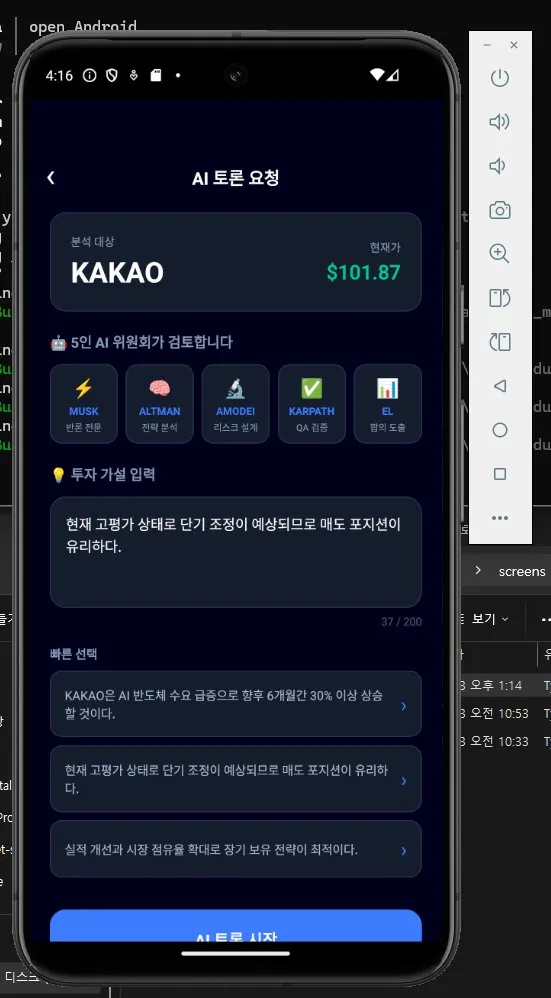
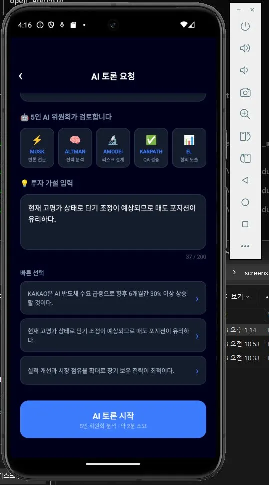
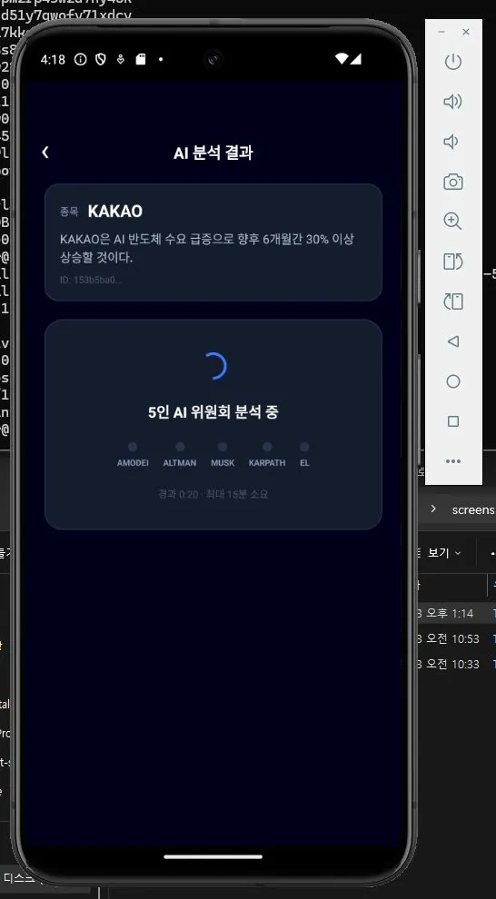
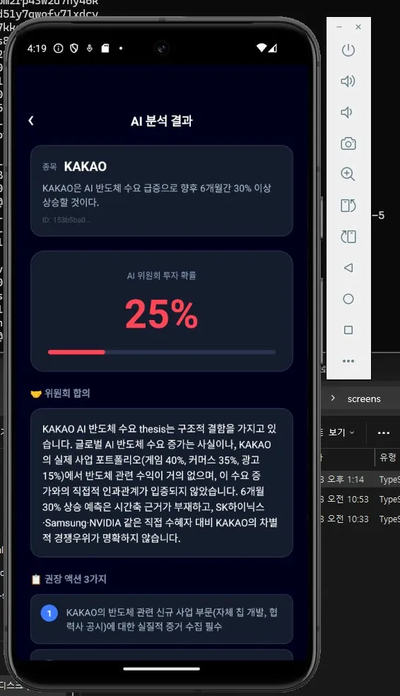
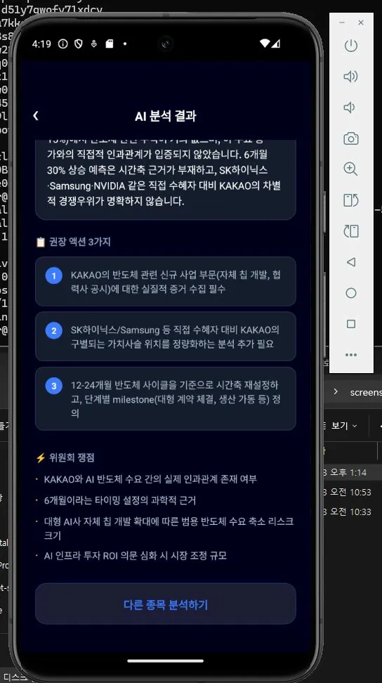

# StockProject — AI Investment Analysis Platform

> **5인 AI 페르소나가 순차 토론으로 투자 thesis를 검증하는 풀스택 플랫폼**  
> Kotlin + Spring WebFlux + Kafka + React Native (Expo) · DDD/Hexagonal Architecture

---

## 📱 스크린샷

| 메인 시세 화면 | 드롭다운 검색 | 종목 상세 |
|:---:|:---:|:---:|
|  |  |  |

| AI 토론 요청 | 토론 시작 | 분석 중 |
|:---:|:---:|:---:|
|  |  |  |

| AI 분석 결과 | 권장 액션 |
|:---:|:---:|
|  |  |

---

## 핵심 아이디어

주식 매수 결정 전, 5명의 AI 전문가(AMODEI → ALTMAN → MUSK → KARPATHY → EL)가  
순차적으로 투자 thesis에 반론·근거를 제시하고, KARPATHY가 가부(통과/보류/실패)를 판정합니다.  
단순한 AI 챗봇이 아니라 **confirmation bias를 구조적으로 제거하는 multi-agent 의사결정 시스템**입니다.

---

## 아키텍처 개요

```
┌─────────────────────────────────────────────────────┐
│           React Native App (Expo SDK 51)             │
│  [시세 화면]   [토론 요청 화면]   [토론 결과 화면]  │
└───────┬────────────────┬────────────────┬────────────┘
        │ WebSocket      │ POST           │ GET (3s polling)
        ▼                ▼                ▼
┌──────────────┐   ┌──────────────────────────────────┐
│  market-svc  │   │         ai-debate-svc             │
│  :8081       │   │         :8083                     │
│              │   │                                    │
│ WebSocket    │──▶│  Kafka Consumer                   │
│ 3s streaming │   │  DebateOrchestrationService       │
│ Redis cache  │   │  PhaseOrchestrator (5 personas)   │
│ Kafka pub    │   │  InMemoryRepository               │
└──────┬───────┘   └──────────────────────────────────┘
       │                        ▲
       │   debate.requested     │ consume
       ▼                        │
┌─────────────────────────────────────────────────────┐
│      Apache Kafka  (topic: debate.requested)         │
│      ZooKeeper (:2182) · Kafka (:9093)               │
└─────────────────────────────────────────────────────┘
       │
       ▼
┌─────────────────┐
│   Redis :6380   │  (market-svc 시세 캐시)
└─────────────────┘
```

---

## 5인 AI 페르소나 시스템

| 순서 | 페르소나 | 역할 | 출력 |
|------|---------|------|------|
| 1 | **AMODEI** (Dario Amodei) | 안전성·리스크 설계 초안 | DoD + Risk 3개 |
| 2 | **ALTMAN** (Sam Altman) | 현실성·전략 평가 | 비즈니스 타당성 검토 |
| 3 | **MUSK** (Elon Musk) | 가정에 반론 2개 이상 | First-principles 파괴적 분석 |
| 4 | **KARPATHY** (Andrej Karpathy) | 전체 QA 판정 | PASS / HOLD / FAIL **거부권 보유** |
| 5 | **EL** (Secretary) | 최종 합의 종합 | 합의 사항 · 액션 3개 · 피드백 |

**핵심 규칙:** 각 페르소나는 이전 발언만 참조 (partial visibility) → confirmation bias 제거

---

## 기술 스택

### Backend
| 서비스 | 기술 | 포트 |
|--------|------|------|
| ai-debate-svc | Kotlin · Spring WebFlux · Kafka Consumer | 8083 |
| market-svc | Kotlin · Spring WebFlux · WebSocket · Redis | 8081 |
| Kafka | confluentinc/cp-kafka:7.5.0 | 9093 |
| ZooKeeper | confluentinc/cp-zookeeper:7.5.0 | 2182 |
| Redis | redis:7-alpine | 6380 |

### Frontend
| 항목 | 기술 |
|------|------|
| 프레임워크 | Expo SDK 51 · React Native · TypeScript |
| 상태관리 | React Hooks (useState, useEffect) |
| WebSocket | 커스텀 훅 `useStockQuote` (자동 재연결) |
| 네비게이션 | Stack Navigator |

### Architecture
- **DDD + Hexagonal Architecture** (ai-debate-svc)
- **Kafka Event-Driven** (market-svc publish → ai-debate-svc consume)
- **Mock/Prod Profile 분리** (`@Profile("mock")` / `@Profile("prod")`)

---

## 디렉토리 구조

```
stockProject/
├── docker-compose.yml          ← 전체 스택 단일 기동
├── docs/screens/               ← 앱 스크린샷
├── ai-debate-svc/              ← 5인 토론 서비스
│   ├── Dockerfile              ← multi-stage build
│   ├── src/main/kotlin/
│   │   └── com/invest/debate/
│   │       ├── domain/         ← DebateSession, PersonaType, ValueObjects
│   │       ├── application/    ← DebateOrchestrationService, PhaseOrchestrator
│   │       └── infrastructure/ ← Kafka Consumer/Producer, LLM Adapters, Web
│   └── src/test/kotlin/        ← JUnit5 11 tests
├── market-svc/                 ← 시세 스트리밍 서비스
│   ├── Dockerfile              ← multi-stage build
│   ├── src/main/kotlin/
│   │   └── com/stockproject/market/
│   │       ├── domain/         ← StockQuote, MarketPort
│   │       ├── application/    ← MarketService
│   │       └── adapter/        ← WebSocket, Kafka, Redis, MockQuote
│   └── src/test/kotlin/        ← JUnit5 13 tests
└── stock-app/                  ← React Native 앱
    ├── App.tsx                 ← Stack Navigator
    └── src/
        ├── constants/api.ts    ← endpoint 상수
        ├── hooks/useStockQuote.ts ← WebSocket 훅
        └── screens/            ← 3화면
```

---

## 실행 방법

### 전체 스택 기동 (Docker Compose)

```cmd
cd C:\dev\portfolio\stockProject
docker compose up -d --build
```

```cmd
REM 상태 확인
docker ps -a --filter name=stock-

REM 로그 확인
docker logs stock-market-svc --tail 50
docker logs stock-debate-svc --tail 50
```

### React Native 앱 실행

```cmd
cd C:\dev\portfolio\stockProject\stock-app
npx expo start --android
```

> Android 에뮬레이터에서 `localhost` → `10.0.2.2` 자동 변환 (api.ts 설정)

### 종료 및 볼륨 초기화

```cmd
cd C:\dev\portfolio\stockProject
docker compose down        ← 컨테이너만 종료
docker compose down -v     ← 볼륨 포함 완전 초기화 (Kafka 재기동 시 권장)
```

---

## API 엔드포인트

| 메서드 | 경로 | 서비스 | 설명 |
|--------|------|--------|------|
| `WS` | `ws://localhost:8081/ws/quotes/{symbol}` | market-svc | 실시간 시세 스트리밍 (3초 간격) |
| `GET` | `http://localhost:8081/actuator/health` | market-svc | 헬스체크 |
| `POST` | `http://localhost:8083/debate/start` | ai-debate-svc | 토론 요청 시작 (202 Accepted) |
| `GET` | `http://localhost:8083/debate/{id}/report` | ai-debate-svc | 토론 결과 조회 |
| `GET` | `http://localhost:8083/debate/{id}/status` | ai-debate-svc | 진행 상태 조회 (RN polling) |
| `GET` | `http://localhost:8083/actuator/health` | ai-debate-svc | 헬스체크 |

---

## 테스트

```cmd
REM ai-debate-svc (11 tests)
cd ai-debate-svc
gradlew test

REM market-svc (13 tests)
cd market-svc
gradlew test
```

| 서비스 | 테스트 파일 | 통과 수 |
|--------|------------|--------|
| ai-debate-svc | PhaseOrchestratorTest, DebateSessionTest | 11 |
| market-svc | MarketServiceTest, QuoteWebSocketHandlerTest, MockStockQuoteAdapterTest, DebateKafkaProducerTest | 13 |

---

## 환경 설정

| 변수 | 기본값 | 설명 |
|------|--------|------|
| `SPRING_PROFILES_ACTIVE` | `mock` | `prod` 으로 변경 시 Claude API 실 연결 |
| `KAFKA_BOOTSTRAP_SERVERS` | `kafka:9092` | Docker 내부 통신 |
| `REDIS_HOST` | `market-redis` | Docker 내부 통신 |
| `ANTHROPIC_API_KEY` | — | `.env` 파일에 추가 |

### Claude API 활성화

```bash
# 루트에 .env 파일 생성 (.gitignore에 추가 필수)
echo ANTHROPIC_API_KEY=sk-ant-xxxx > .env
```

`docker-compose.yml`의 ai-debate-svc 환경변수 주석 해제:
```yaml
# ANTHROPIC_API_KEY: ${ANTHROPIC_API_KEY}  ← 이 줄 주석 해제
```

---

## 개발 배경

> 포트폴리오 목적 + 실제 투자 의사결정 보조 도구로 병행 개발.  
> "5인 AI 토론이 단일 AI 판단보다 confirmation bias를 제거한다"는 가설을 구현.  
> 목표: 토스뱅크 / 카카오페이 백엔드 포지션 지원.
